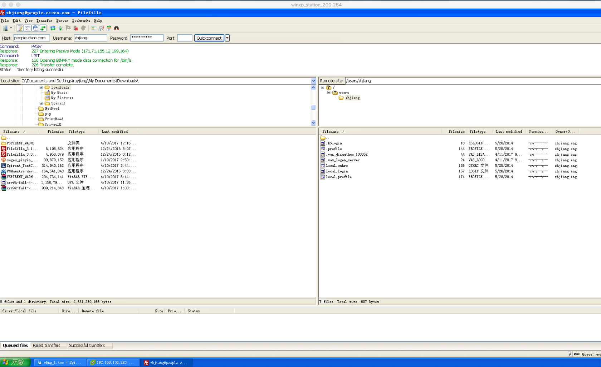
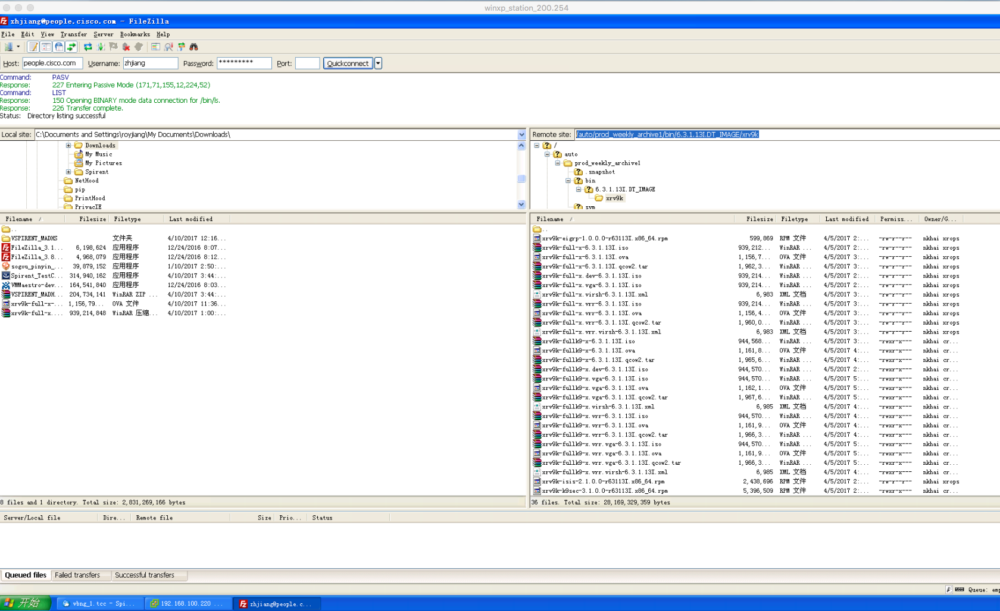

# sunstone-vbng-on-esxi

## This is a test line

Cisco IOS XRv 9000 Router based vBNG lab guide

# 1. Prelude
In this document, I will guide you, step by step, to build a simple vBNG testbed in a single physical X86 server running ESXi as hypervisor.
We will have following VM running on top of the ESXi host
- A vBNG, which is essentially a Cisco IOS XRv 9000 Router
- A vServer  - linux based VM acting as RADIUS server and/or DHCP server
- Couple of vClient - windows VM or linux VM to simulate CPEs to initiate PPPoE and/or IPoE sessions
- Optional, a Virtual traffic generator.
The EXSi host has networks reach out to the outside, so you can also use external physical RADIUS server and external Client to cooperate with the vBNG.

The purpose of this simple testbed is to show off the functionality of Cisco vBNG, performance and scale are not our target, so no optimisation is made for this purpose.

# 2. Topology

### Physical topology

The ESXi host runs ESXi 5.50, detail release information show as following display in ESXi host CLI

	'' ~ # uname -a
	VMkernel localhost.Roy_F1 5.5.0 #1 SMP Release build-1331820 Sep 18 2013 23:08:31 x86_64 GNU/Linux
hardware configuration of the ESXi host show as following
 
A Linux host named “ubuntu-demo” used as SSH client.
A Win\_PC
- Running ESXi vSphere client
- Running Spirent Testcenter application to control a virtual testcenter VM running as guest in ESXi host

### Logical topology
 
This picture shows the logical topology built inside ESXi virtualization environment. 
- 3 ESXi Standard vSwitchs need to be created for networking within the hypervisor and with outside world.
	- vSwitch0 is there already
		- In this vSwitch there is a Virtual  Machine Port Group(you can think it is a L2 bridge-domain in Cisco’s term) labeled  “VM Network “, without any VLAN enabled. All of the VMs we created need to have one of its network adapters connected to this port group or bridge-domain.
		- A physical NIC of the ESXi host named “vmnic0” is also in this port group. In that way, a external host can visit the VMs via physical network adapter vmnic0.
		- Please be noted, besides the VM port group to which VM is connected, on this vSwitch there is a VMkernal port to which the management network interface of the ESXi is connected. 
	- vSwitch2 is a vSwitch we need to created.
		- We use vSwitch2 as an access switch between our client and BNG.
		- Imaging you are configure a cisco switch, we will create a switch with 4 ports
			- One access port of VLAN 1, connected to a VM simulating the PPPoE/IPoE client. Untagged packet sent by client is tagged with the configured VLAN ID and forwarded to the BNG via a trunk port, arriving at BNG with VLAN ID 1 included.
			- Another access port, configured with VLAN 2, for another client.
			- One trunk port allowing all VLAN, connected to the virtual testcenter (traffic generator) which can send tagged or double tagged packet.
			- Another trunk port connected to BNG interface G0/0/0/0. Packet arrive at BNG over this trunk is tagged, please be noted BNG does not support untagged packet to trigger a PPPoE or IPoE session, another word, BNG functionality must be enabled in a sub interface with VLAN or QinQ encapsulation specified.
	 - vSwitch3 is another vSwitch we need to created, we use it as the core facing network, hence no VLAN needed. Just think it is another physical switch on the core side through which the VBNG reach out to the Spirent TS port and RADIUS server. 

- A vBNG virtual machine is about to be instantiated in ESXi, named vBNG-1
	- To simplify the testbed, we only use one management interface and two gigabit interfaces of the vBNG.
		- The router interface mg0/RP0/CPU0/0 is virtually connected or, in Vmware’s term, mapped to the Port Group (you can think it is a L2 bridge domain in Cisco’s term) labeled  “VM Network “,  connected to the external.
		-   The router interface G0/0/0/0 and G0/0/0/1 are used as access facing and core facing interface respectively, virtually connected to different network according to the design.
	- To configure the vBNG IOS XR from console, we use ESXi like a terminal server or console server, one can access the console by telnet to ESXi admin address with a port, which is set in ESXi when we install the vBNG VM.   

-  A Linux server virtual machine is about to be instantiated in ESXi, named `VM_linux_server`, acting as RADIUS/DHCP server.
- There are two VMs to simulate PPPoE/IPoE client, one Windows XP and one Linux.
- As a luxury you may not able to copy in your case, in my lab there is a Sprint Testcenter Virtual Ports VM installed on ESXi host. This is a VNF of traffic generator from Spirent. A testcenter application is running in a physical windows Win\_PC as a GUI based client, controlling the TC VM over the network of 192.168.100.0/24. To use the TC VM, the VM need to communicate to a licensing server which is inside Cisco corporate network.

# Step 1. Get the Cisco IOS XRv 9000 image, store it in the PC running vSphere client

For external user, the Cisco IOS XRv 9000 image could be downloaded from place provided by you Cisco after you purchase it.

For Cisco internal user, it could be downloaded from an internal folder. What I am using in this case is an internal engineering image (latest 6.3.1 DT image as time of writing), the information of the image is listed in the internal [DT wiki page](http://wiki-eng.cisco.com/engwiki/XR631_5f13I), indicating the image is located in `/auto/prod_weekly_archive1/`. 

## Image download approach 1:
FTP from a host within Cisco VPN , this approach works for all of the Cisco employees.
1. Landing to ftp://people.cisco.com with your CEC username/password

2. Paste the path  `/auto/prod_weekly_archive1/bin/6.3.1.13I.DT_IMAGE ` to the remote site and click enter

3. Download the image `xrv9k-full-x-6.3.1.13I.ova `
4. In my case, the PC used as FTP client is also the PC runs sphere client in my case, so the image is ready to install in ESXi host.

## Image download approach 2:
Use linux command SCP to download the image to your local linux host, also need to be inside Cisco VPN. This way you need the access to a cisco internal linux server. 

1. From my MAC, SSH to an internal server and browse the folder to find the correct image
	ZHJIANG-M-L02P:~ royjiang$ ssh zhjiang@sjc-xdm-141
	'' zhjiang@sjc-xdm-141's password:
	Last login: Sun Apr  9 18:52:46 2017 from shn-zhjiang-8812.cisco.com
	Terminal is set to: xterm-256color
	Display is not set.
	sjc-xdm-141:97> cd /auto/prod_weekly_archive1/bin/6.3.1.13I.DT_IMAGE
	sjc-xdm-141:98> ls -l
	total 52
	drwxr-xr-x 2 nkhai xrops 4096 Apr  5 22:01 asr9k-px
	drwxr-xr-x 2 nkhai xrops 4096 Apr  5 17:54 asr9k-x64
	drwxr-xr-x 2 nkhai xrops 4096 Apr  5 14:57 enxr
	drwxr-xr-x 2 nkhai xrops 4096 Apr  5 16:51 hfr-px
	drwxr-xr-x 2 nkhai xrops 4096 Apr  5 16:07 iosxrv-x64
	drwxr-xr-x 2 nkhai xrops 4096 Apr  5 15:27 ncs1001
	drwxr-xr-x 2 nkhai xrops 4096 Apr  5 15:41 ncs1k
	drwxr-xr-x 2 nkhai xrops 4096 Apr  5 15:42 ncs4k
	drwxr-xr-x 2 nkhai xrops 4096 Apr  5 16:36 ncs5500
	drwxr-xr-x 2 nkhai xrops 4096 Apr  5 21:40 ncs5k
	drwxr-xr-x 2 nkhai xrops 4096 Apr  5 18:10 ncs6k
	drwxr-xr-x 2 nkhai xrops 4096 Apr  5 19:41 xrv9k
	drwxr-xr-x 2 nkhai xrops 4096 Apr  5 16:16 xrvr
	
	sjc-xdm-141:99> cd xrv9k/
	sjc-xdm-141:100> ls -l
	total 27617600
	-rw-r--r-- 1 nkhai xrops      599869 Apr  5 14:38 xrv9k-eigrp-1.0.0.0-r63113I.x86_64.rpm
	-rw-r--r-- 1 nkhai xrops   939212800 Apr  5 14:44 xrv9k-full-x-6.3.1.13I.iso
	-rw-r--r-- 1 nkhai xrops  1156792320 Apr  5 15:21 xrv9k-full-x-6.3.1.13I.ova
	-rw-r--r-- 1 nkhai xrops  1962373120 Apr  5 15:22 xrv9k-full-x-6.3.1.13I.qcow2.tar
	-rw-r--r-- 1 nkhai xrops   939214848 Apr  5 14:32 xrv9k-full-x.dev-6.3.1.13I.iso
	-rw-r--r-- 1 nkhai xrops   939214848 Apr  5 14:32 xrv9k-full-x.vga-6.3.1.13I.iso
	-rw-r--r-- 1 nkhai xrops        6983 Apr  5 15:22 xrv9k-full-x.virsh-6.3.1.13I.xml
	-rw-r--r-- 1 nkhai xrops   939214848 Apr  5 15:50 xrv9k-full-x.vrr-6.3.1.13I.iso
	-rw-r--r-- 1 nkhai xrops  1156403200 Apr  5 15:49 xrv9k-full-x.vrr-6.3.1.13I.ova
	-rw-r--r-- 1 nkhai xrops  1960089600 Apr  5 15:50 xrv9k-full-x.vrr-6.3.1.13I.qcow2.tar
	-rw-r--r-- 1 nkhai xrops        6983 Apr  5 15:50 xrv9k-full-x.vrr.virsh-6.3.1.13I.xml
	-rwxr-x--- 1 nkhai crypto  944568320 Apr  5 15:50 xrv9k-fullk9-x-6.3.1.13I.iso
	-rwxr-x--- 1 nkhai crypto 1161850880 Apr  5 16:18 xrv9k-fullk9-x-6.3.1.13I.ova
	-rwxr-x--- 1 nkhai crypto 1965690880 Apr  5 16:20 xrv9k-fullk9-x-6.3.1.13I.qcow2.tar
	-rwxr-x--- 1 nkhai crypto  944570368 Apr  5 14:44 xrv9k-fullk9-x.dev-6.3.1.13I.iso
	-rwxr-x--- 1 nkhai crypto  944570368 Apr  5 17:26 xrv9k-fullk9-x.vga-6.3.1.13I.iso
	-rwxr-x--- 1 nkhai crypto 1162158080 Apr  5 17:24 xrv9k-fullk9-x.vga-6.3.1.13I.ova
	-rwxr-x--- 1 nkhai crypto 1967616000 Apr  5 17:26 xrv9k-fullk9-x.vga-6.3.1.13I.qcow2.tar
	-rwxr-x--- 1 nkhai crypto       6985 Apr  5 16:20 xrv9k-fullk9-x.virsh-6.3.1.13I.xml
	-rwxr-x--- 1 nkhai crypto  944570368 Apr  5 16:49 xrv9k-fullk9-x.vrr-6.3.1.13I.iso
	-rwxr-x--- 1 nkhai crypto 1161912320 Apr  5 16:48 xrv9k-fullk9-x.vrr-6.3.1.13I.ova
	-rwxr-x--- 1 nkhai crypto 1966387200 Apr  5 16:49 xrv9k-fullk9-x.vrr-6.3.1.13I.qcow2.tar
	-rwxr-x--- 1 nkhai crypto  944570368 Apr  5 17:55 xrv9k-fullk9-x.vrr.vga-6.3.1.13I.iso
	-rwxr-x--- 1 nkhai crypto 1161912320 Apr  5 17:54 xrv9k-fullk9-x.vrr.vga-6.3.1.13I.ova
	-rwxr-x--- 1 nkhai crypto 1966325760 Apr  5 17:55 xrv9k-fullk9-x.vrr.vga-6.3.1.13I.qcow2.tar
	-rwxr-x--- 1 nkhai crypto       6985 Apr  5 16:49 xrv9k-fullk9-x.vrr.virsh-6.3.1.13I.xml
	-rw-r--r-- 1 nkhai xrops     2438696 Apr  5 14:38 xrv9k-isis-2.1.0.0-r63113I.x86_64.rpm
	-rwxr-x--- 1 nkhai crypto    5396509 Apr  5 14:38 xrv9k-k9sec-3.1.0.0-r63113I.x86_64.rpm
	-rw-r--r-- 1 nkhai xrops      336948 Apr  5 14:32 xrv9k-li-x-1.1.0.0-r63113I.x86_64.rpm
	-rw-r--r-- 1 nkhai xrops        4953 Apr  5 14:38 xrv9k-m2m-2.0.0.0-r63113I.x86_64.rpm
	-rw-r--r-- 1 nkhai xrops    24993524 Apr  5 14:38 xrv9k-mgbl-3.0.0.0-r63113I.x86_64.rpm
	-rw-r--r-- 1 nkhai xrops   889292800 Apr  5 14:26 xrv9k-mini-x-6.3.1.13I.iso
	-rw-r--r-- 1 nkhai xrops     2558898 Apr  5 14:38 xrv9k-mpls-2.1.0.0-r63113I.x86_64.rpm
	-rw-r--r-- 1 nkhai xrops     9741896 Apr  5 14:38 xrv9k-mpls-te-rsvp-2.2.0.0-r63113I.x86_64.rpm
	-rw-r--r-- 1 nkhai xrops     3796729 Apr  5 14:32 xrv9k-ospf-2.0.0.0-r63113I.x86_64.rpm
	-rw-r--r-- 1 nkhai xrops      921785 Apr  5 14:38 xrv9k-parser-2.0.0.0-r63113I.x86_64.rpm
	sjc-xdm-141:101>

2. From my MAC, SCP the image to my MAC. Please be noted, in my case I have no permission to download the K9 version. 

	royjiang@ubuntu-demo:~$ scp zhjiang@sjc-xdm-141:/auto/prod_weekly_archive1/bin/6.3.1.13I.DT_IMAGE/xrv9k/xrv9k-full-x-6.3.1.13I.ova xrv9k-full-x-6.3.1.13I.ova
	
	  --snip-- 
	zhjiang@sjc-xdm-141's password:
	xrv9k-full-x-6.3.1.13I.ova                                                                                                                                                                                                                   21%  234MB 169.7KB/s 1:27:26 ETA

3. Copy it to the PC running ESXi vSphere client

With the image store in the PC running ESXi vSphere client, your are ready to do next step.

# Step 2. Create the networks on ESXi
Login the vSphere from Win\_PC

**Convention of the annotation in the screen capture**
- The red bubble with sequence number means the sequent mouse click to get to the window. 
- Green highlighted places have text explanation.
## Step 2.1 check the network for management
This is the network to which the VMs we are about to installed must connect for management purpose. 
- The name or label of the network  “VM Network”, which is cerated at the beginning of ESXi installation.
- VLAN of this network is none
- This is the VMkernel port of the ESXi itself, your vSphere client connects to this IP address to controll the ESXi.
- This network is only present in vSwitch0

> ## Understanding the networking concept and logic in ESXi 
> A “network”, which is the term used when you create it in ESXi vSphere client, is display as “Virtual Machine port-group” in the networking view. From a networking engineer’s point of view, I think the term “Virtual Machine port-group” is more accurate, following is my understanding.
> 
> A VM running on the ESXi has its network adaptor connected to a “port” belong to a “Virtual Machine port-group” in a vSwitch.
> 
> One property of a “Virtual Machine port-group” is the VLAN ID setting. It could be none(0), individual VLAN ID [1,2,3,4], or all(0)
> 
> Ports belong to a “Virtual Machine port-group” with VLAN ID none is similar to a port in a physical cisco switch  without any VLAN configured.
> 
> Ports belong to a “Virtual Machine port-group” with VLAN ID 1 (or 2,3,4) is similar to a port in a physical Cisco switch  configured as switchport access vlan 1, its input/output packet must be untagged.
> 
> Ports belong to a “Virtual Machine port-group” with VLAN ID all is similar to a port in a physical Cisco switch configured as switchport trunk all vlan all, its input/output packet could be tagged packet.
> 
> A untagged packet entering a port belong to “Virtual Machine port-group” with VLAN Id 1 could be forwarded to a  port belong to a “Virtual Machine port-group” with VLAN ID all, leaving the port with dot1q 1 tagged.

## Step 2.2 add  access side network 
### Step 2.2.1 Create vSwitch2 and Add network VLAN1 in vSwitch2

In this step, we are going to create a new network named VLAN1(or you can give it another name as you like), which is identified with vlan id 1, in a new vSwitch.

Please be noted, the new vSwitch could not be created before adding any network on it, instead, it is created together when we create the first new network.

The name of the newly created vSwitch is not manually configurable, ESXi named it automatically so in you lab you may see a different name. 

From previous window, let’s add a new network.
In the add network wizard, check the Virtual Machine as connection type. 
Then Click Next button.

The network we are about to add is on a new switch, so firstly you need to create a new vSphere switch , rather than using existing vSwitch.
Uncheck any physical port, since this is a network purely inside the ESXi, without any port reachable from outside of the ESXi host via its physical network adapter.

Click next button.

Change the Network Label to a meaningful name, in my case, `VLAN1`,and set the VLAN Id to 1(translated to Cisco configure `switchport access vlan 1`).  
Click next button, then Finish button.

Now you have a layer 2 bridge-domain created in the newly created vSwitch, named vSwitch2 automatically by the ESXi. The new network/bridge-domain is named VLAN1, identified with VLAN ID 1. This is just similar to enabling a VLAN in a Cisco physical switch. You can see a new vSwitch is displayed and check its properties, shown as the following.

## Step 2.2.2 Add network VLAN2 in vSwitch2
Similar to Step 2.2.1. In this step, we are going to create a new network named VLAN2(or you can give it another name as you like), which is identified with vlan id 1, in a new vSwitch just crated in step 2.2.1.  

Click the properties of  newly created vSwitch2 to add a new port.

Click next button.

Change the Network Label to a meaningful name, in my case, `VLAN2`,and set the VLAN Id to 2 (translated to Cisco configure `switchport access vlan 2`).
Click next button, then Finish button.

## Step 2.2.3 Add network TRUNK in vSwitch2
Following Step 2.2.2,  in the same vSwitch just crated in step 2.2.1, we are going to create a new network (port group)named TRUNK, whose member is a “trunk” port, allowing all VLAN.

Click next button.

Change the Network Label to a meaningful name, in my case, `TRUNK`,and set the VLAN Id to ALL (translated to Cisco configure `switchport trunk allow vlan all`).
Click next button, then Finish button.

## Step 2.3 add core side network 
### Step 2.3.1 Create vSwitch3 and Add network CORE in it.
It is not mandatory to create the core side network in a new vSwitch, in fact, it could also be created as a non-VLAN network in vSwitch2 without any conflict. But personally I think a separate vSwitch make the logical topology easier to understand.

From previous window, let’s add a new network.
In the add network wizard, check the Virtual Machine as connection type. 
Then Click Next button.

The network we are about to add is on a new switch, so firstly you need to create a new vSphere switch , rather than using existing vSwitch.
Uncheck any physical port, since this is a network purely inside the ESXi, without any port reachable from outside of the ESXi host via its physical network adapter.

Click next button.

 
Change the Network Label to a meaningful name, in my case, `CORE`,and set the VLAN Id to none.

Click next button, then Finish button.

 

## View of networking in ESXi
Now all of the needed the networks have been added in ESXi, in vSphere client the view of networking is as following( irrelevant part is blurred). 
This is exactly same logical networking topology as that in the previous chapter , but presented in ESXi’s way.  

At this moment, we have not yet installed any VM.

 

# Step 3. Install the Cisco IOS XRv 9000 Router in ESXi
In this step, what you need to do is to follow the general installation guide of Cisco IOS XRv 9000 Router, with some customised setting for the networking in ESXi to accommodate our vBNG testing environment.

I have had a VBNG called `Cisco_IOS_XRv_9000_BNG_2` installed already, now I would like to install a new one named `Cisco_IOS_XRv_9000_BNG_1` .

I am following a general installation guide from CCO website,
[Chapter: Installing the Cisco IOS XRv 9000 Router in VMware ESXi Environments](http://www.cisco.com/c/en/us/td/docs/routers/virtual-routers/configuration/guide/b-xrv9k-cg/b-xrvirtual9k-cg_chapter_010.html), you will see step-by-step explanation in this part with customised setting.

## Installing the Cisco IOS XRv 9000 Router to the VM using OVA Template

## Step 3.1  
In the vSphere client, select File \> Deploy OVF Template.

## Step 3.2  
Select the location where the Cisco IOS XRv 9000 Router .ova file is stored and click Next.

## Step 3.3  
Verify OVF template details, and click Next.

## Step 3.4  
Specify the name of the VM, select Inventory Location, and click Next.

In this step ,I set the name of the VM to “`Cisco_IOS_XRv_9000_BNG_1`”

## Step 3.5 (no this step in my installation)  
(Cisco IOS XR Release 5.4 and later) Select a hardware deployment configuration from the drop-down, and click Next.

## Step 3.6  
Select the datastore for the VM files, and click Next.

## Step 3.7  
Select the format in which virtual disks are stored, and click Next.
These are the disk formats you can choose:
•	Thick Provision Lazy Zeroed  

•	Thick Provision Eager Zeroed  

•	Thin Provisioned  

Note   
The Thick Provision Eager Zeroed option takes longer duration to install but provides better performance. Thick Provisioned will also consume more physical space on the disk.

I am using the default option, Thick Provision Lazy Zeroed
 

### Step 3.8  
Under Network Mapping, allocate one or more virtual network interface card (vNIC) on the destination network using the drop-down list.
For information on interface mapping, see the Mapping the Router Network Interfaces to VM Network Interface Cards.

According to the logical topology
- vBNG Interface MgmtEth0\_RP0\_CPU0  is “mapped” or connected to network labeled VM Network. 
- vBNG Interface g0/0/0/0  is “mapped” or connected to network labeled TRUNK, so this is the access facing interface.. 
- vBNG Interface g0/0/0/1  is “mapped” or connected to network labeled VM Network, so this is the core facing interface.
- Other interface in vBNG could be mapped to any network, I am not going to use them at this moment. We can change the setting after the VM is instantiated no problem.

### Step 3.9  
In the Virtual Machine Properties window configure the properties for the VM if available. This will vary depending on release.

### Step 3.10  (optional)
Select Power on after deployment to automatically power on the VM.
My recommendation is not select it, since after the VM deployment complete, we need to add a console port with the VM powered down.

### Step 3.11  
Click Finish to deploy the OVA.

### VM Deployment completed

It takes around 30 minute in my environment.

Check the VM status

### Step 3.12 Set Console Access in VMware ESXi then power on the vBNG VM 
If you, as what I did sadly, power on the VM and try to login the console from vSphere client console, you will see following screen saying you are not able to use the vSphere client console.

The reason is I deployed the VM without VGA simulation, so I can not use the vSphere client console to login the ISO XRv. The IOS XRv console is mapped to the first serial port of the VM, you need to add it in ESXi,of course virtually,
following the [Guide of Accessing the Console Port](http://www.cisco.com/c/en/us/td/docs/routers/virtual-routers/configuration/guide/b-xrv9k-cg/b-xrv9k-cg_chapter_0101.html#concept_7BC63D289EBE47C99E886F081591ED3A).

This procedure explains how to configure the serial console access in VMware ESXi using VMware vSphere. For more information, refer to the VMware vSphere documentation.

#### Step 3.12.1  Power-down the VM. (It is powered down_ 
#### Step 3.12.2  Select the VM and configure the virtual serial port settings:
a.	Choose Edit Settings \> Add
b.	Choose Device Type \> Serial port and click Next.
    
c.	Choose Select Port Type, select Connect via Network and then click Next.

#### Step 3.12.3  

Choose the Select Network Backing and then do the following:
•	Select Server (VM listens for connection)  

•	Enter the Port URI using the following syntax: telnet://esxi-host-ipaddress:portnumber (In my case it is set to [telnet://192.168.200.220:2001](telnet://192.168.200.220/2121) )  
where portnumber is the port number for the virtual serial port.  

•	Under I/O mode, select Yield CPU on poll.  

•	Click Next then Finish.
  

#### Step 3.12.4  
Power-on the VM.
When the VM is powered on, access the virtual serial port console. If you are unable to access the virtual serial port, then perform step 5.

**username/password is set to root/root in my case**

#### Step 3.12.5   (no need to take this step in my case)
Configure the security settings for the virtual serial port.
•	Select the ESXi host for the virtual serial port.  

•	Click the Configuration tab and then click Security Profile.  

•	In the Firewall section, click Properties, and then select the VM serial port connected over Network value.

 

## Step 4 First time login and configure the vBNG 
First time when we power on the VM, the IOS XRv is also loaded, we can access the console of IOS XRv and asked to set the initiative  root-system username/password.
- You can telnet to the serial port address just set in previous step, like one uses a terminal server :)
- Set the  root-system username/password, in my case, to ROOT/ROOT (sadly in capital when the CAPS key was pressed by mistake)

Following is the display when we login the console to watch the booting of IOS XR first time.
	royjiang@ubuntu-demo:~$ telnet 192.168.200.220 2001
	Trying 192.168.200.220...
	Connected to 192.168.200.220.
	Escape character is '^]'.
	
	Thu Apr 13 15:42:08 UTC 2017 (/proc/self/fd/9): Hardware profile: vpe
	Thu Apr 13 15:42:08 UTC 2017 (/proc/self/fd/9): Host has 15.51GB RAM / 4 vCPUs
	Thu Apr 13 15:42:08 UTC 2017 (/proc/self/fd/9): Management plane: 1024MB RAM
	Thu Apr 13 15:42:08 UTC 2017 (/proc/self/fd/9): XR control plane: 5120MB RAM
	Thu Apr 13 15:42:08 UTC 2017 (/proc/self/fd/9): XR packet memory: 128MB RAM
	Thu Apr 13 15:42:08 UTC 2017 (/proc/self/fd/9): Centralized LC: 9216MB RAM
	Thu Apr 13 15:42:08 UTC 2017 (/proc/self/fd/9): Data plane core assignment: 2-3
	Thu Apr 13 15:42:08 UTC 2017 (/proc/self/fd/9): Control plane core assignment: 0-1
	
	################################################################################
	#                                                                              #
	#                  Welcome to the Cisco IOS XRv9k platform                     #
	#                                                                              #
	#    Please wait for Cisco IOS XR to start.                                    #
	#                                                                              #
	#    Copyright (c) 2014-2017 by Cisco Systems, Inc.                            #
	#                                                                              #
	################################################################################
	Telnet escape character is '^Q'.
	Trying 127.0.0.1...
	Connected to localhost.
	Escape character is '^Q'.
	
	init: Unable to create device: /dev/kmsg
	mount: can't find /dev in /etc/fstab
	mkdir: cannot create directory '/run': File exists
	bootlogd: ioctl(/dev/pts/2, TIOCCONS): Device or resource busy
	Running postinst /etc/rpm-postinsts/100-dnsmasq...
	update-rc.d: /etc/init.d/run-postinsts exists during rc.d purge (continuing)
	 Removing any system startup links for run-postinsts ...
	  /etc/rcS.d/S99run-postinsts
	Configuring network interfaces... done.
	Starting system message bus: dbus.
	Starting OpenBSD Secure Shell server: sshd
	  generating ssh RSA key...
	  generating ssh ECDSA key...
	  generating ssh DSA key...
	  generating ssh ED25519 key...
	sshd start/running, process 2108
	Starting rpcbind daemon...done.
	Libvirt not initialized for container instance
	Starting system log daemon...0
	tftpd-hpa disabled in /etc/default/tftpd-hpa
	Starting internet superserver: xinetd.
	Starting Lighttpd Web Server: lighttpd.
	Starting crond: OK
	SIOCSIFTXQLEN: No such device
	SIOCSIFTXQLEN: No such device
	
	
	ios con0/RP0/CPU0 is now available
	
	
	
	
	
	Press RETURN to get started.
	
	
	
	
	
	!!!!!!!!!!!!!!!!!!!! NO root-system username is configured. Need to configure root-system username. !!!!!!!!!!!!!!!!!!!!
	
	         --- Administrative User Dialog ---
	' 
	  Enter root-system username:
	  % Entry must not be null.
	
	  Enter root-system username: 0/RP0/ADMIN0:Apr 13 15:49:54.157 : vm_manager[3390]: %INFRA-VM_MANAGER-4-INFO : Info: vm_manager started VM default-sdr--2
	
	
	  % Entry must not be null.
	
	  Enter root-system username: ROOT
	  Enter secret:
	Use the 'configure' command to modify this configuration.
	User Access Verification
	
	Username: ROOT
	Password:
	
	
	RP/0/RP0/CPU0:ios#

Configure the hostname
	RP/0/RP0/CPU0:ios#conf t
	Thu Apr 13 15:59:45.329 UTC
	RP/0/RP0/CPU0:ios(config)#hostname vbng_2
	RP/0/RP0/CPU0:ios(config)#hostname vbng_1
	RP/0/RP0/CPU0:ios(config)#commi
	Thu Apr 13 16:00:05.361 UTC
	RP/0/RP0/CPU0:vbng_1(config)#
	RP/0/RP0/CPU0:vbng_1(config)#
	RP/0/RP0/CPU0:vbng_1(config)#
	RP/0/RP0/CPU0:vbng_1(config)#exit

	RP/0/RP0/CPU0:vbng_1#sh platform
	Thu Apr 13 16:00:16.430 UTC
	Node              Type                       State             Config state
	--------------------------------------------------------------------------------
	0/0/CPU0          R-IOSXRV9000-LC-C          IOS XR RUN        NSHUT
	0/RP0/CPU0        R-IOSXRV9000-RP-C(Active)  IOS XR RUN        NSHUT
	RP/0/RP0/CPU0:vbng_1#
	RP/0/RP0/CPU0:vbng_1#sh install active
	Thu Apr 13 16:00:24.311 UTC
	Node 0/RP0/CPU0 [RP]
	  Boot Partition: xr_lv0
	  Active Packages: 1
	        xrv9k-xr-6.3.1.13I version=6.3.1.13I [Boot image]
	
	Node 0/0/CPU0 [LC]
	  Boot Partition: xr_lcp_lv0
	  Active Packages: 1
	        xrv9k-xr-6.3.1.13I version=6.3.1.13I [Boot image]
	
	RP/0/RP0/CPU0:vbng_1#
	RP/0/RP0/CPU0:vbng_1#
	RP/0/RP0/CPU0:vbng_1#sh run
	Thu Apr 13 16:00:29.688 UTC
	Building configuration...
	!! IOS XR Configuration version = 6.3.1.13I
	!! Last configuration change at Thu Apr 13 16:00:05 2017 by ROOT
	!
	hostname vbng_1
	username ROOT
	 group root-lr
	 group cisco-support
	 secret 5 $1$5CL7$kFoe45OxpucY.ynzIEURO/
	!
	call-home
	 service active
	 contact smart-licensing
	 profile CiscoTAC-1
	  active
	  destination transport-method http
	 !
	!
	interface MgmtEth0/RP0/CPU0/0
	 shutdown
	!
	interface GigabitEthernet0/0/0/0
	 shutdown
	!
	interface GigabitEthernet0/0/0/1
	 shutdown
	!
	interface GigabitEthernet0/0/0/2
	 shutdown
	!
	interface GigabitEthernet0/0/0/3
	 shutdown
	!
	interface GigabitEthernet0/0/0/4
	 shutdown
	!
	interface GigabitEthernet0/0/0/5
	 shutdown
	!
	interface GigabitEthernet0/0/0/6
	 shutdown
	!
	end
	

## Step 5. Deploy a window XP VM on ESXi as CPE
In this step we deploy a Windows XP VM named `vm_cpe_1_winxp`on ESXi with two network adapters so that we can control it and use it to initiate PPPoE and IPoE session to the vBNG.
The detail steps of VM deployment is not our focus, the only thing you need to pay attention to is the networking part.

## Step 5.1 Set networking On ESXi
We need to map network adapter 1 to network VM Network, and network adapter 2 to network VLAN1 

## Step 5.2 Set networking on the Windows VM

- NIC 1(network adapter 1) is configured with static IPv4 add 192.168.100.181, to which we can visit the PC using windows remote desktop and control the win XP client remotely.
- NIC 2 (network adapter 2)is set to DHCP

## Step 6. Establish your first IPoE session on vBNG

### BNG minimum configuration
We can use this minimum configuration on vBNG to accommodate a DHCPv4 triggered IPoE session initiated from the Win XP client.

In the minimum configuration we have following stuff configured.
- Enable telnet
- Created another username for daily login
- Bring up mgmt interface with IP address 192.168.100.191 configured so that we can telnet
- Bring up core facing interface with ip address configured
- Bring up access facing interface
- Create a sub-interface with encapsulation vlan id 1,  and enable IPoE session termination
- Create IP pool and instantiate a DHCPv4 server inside the vBNG
- Configure the basic unnumbered interface, dynamic-template and control-policy needed to terminate a IPoE session 

	RP/0/RP0/CPU0:vbng_1#sh run
	Fri Apr 14 09:32:44.885 UTC
	Building configuration...
	!! IOS XR Configuration version = 6.3.1.13I
	!! Last configuration change at Fri Apr 14 09:32:11 2017 by royjiang
	!
	hostname vbng_1
	telnet vrf default ipv4 server max-servers 50
	username ROOT
	 group root-lr
	 group cisco-support
	 secret 5 $1$5CL7$kFoe45OxpucY.ynzIEURO/
	!
	username royjiang
	 group root-lr
	 group cisco-support
	 password 7 01001C297A25475D72
	!
	pool vrf default ipv4 IPOE_POOL_1
	 network 100.1.0.0/16 default-router 100.1.255.254
	!
	dhcp ipv4
	 profile SERVER server
	  lease 0 10 0
	  pool IPOE_POOL_1
	 !
	 interface GigabitEthernet0/0/0/0.1 server profile SERVER
	!
	call-home
	 service active
	 contact smart-licensing
	 profile CiscoTAC-1
	  active
	  destination transport-method http
	 !
	!
	interface Loopback1001
	 description loopback for unnumbered
	 ipv4 address 100.1.255.254 255.255.0.0
	!
	interface MgmtEth0/RP0/CPU0/0
	 description access port connected to vswitch0 network VM NETWORK
	 ipv4 address 192.168.100.191 255.255.255.0
	!
	interface GigabitEthernet0/0/0/0
	 description access port connected to vswitch2 network TRUNK
	!
	interface GigabitEthernet0/0/0/0.1
	 ipv4 point-to-point
	 ipv4 unnumbered Loopback1001
	 service-policy type control subscriber PM_IPOE_BASIC
	 encapsulation dot1q 1
	 ipsubscriber ipv4 l2-connected
	  initiator dhcp
	 !
	!
	interface GigabitEthernet0/0/0/1
	 description access port connected to vswitch3 network CORE
	 ipv4 address 222.0.0.1 255.255.255.0
	!
	interface GigabitEthernet0/0/0/2
	 shutdown
	!
	interface GigabitEthernet0/0/0/3
	 shutdown
	!
	interface GigabitEthernet0/0/0/4
	 shutdown
	!
	interface GigabitEthernet0/0/0/5
	 shutdown
	!
	interface GigabitEthernet0/0/0/6
	 shutdown
	!
	dynamic-template
	 type ipsubscriber DT_IPOE_BASIC
	  ipv4 unnumbered Loopback1001
	 !
	!
	!
	class-map type control subscriber match-any DHCPV4
	 match protocol dhcpv4
	 end-class-map
	!
	policy-map type control subscriber PM_IPOE_BASIC
	 event session-start match-first
	  class type control subscriber DHCPV4 do-until-failure
	   10 activate dynamic-template DT_IPOE_BASIC
	  !
	 !
	 end-policy-map
	!
	end

### Quick verification of BNG session
When you turn on the NIC1 in Win XP client, you can see the first IPoE session created in the vBNG.

	RP/0/RP0/CPU0:vbng_1#sh dhcp ipv4 ser binding
	Fri Apr 14 00:18:41.769 UTC
	
	                                           Lease
	 MAC Address      IP Address      State    Remaining       Interface          VRF      Sublabel
	--------------  --------------  ---------  ---------  -------------------  ---------  ----------
	000c.29c3.a03a  100.1.0.1       BOUND      35993      Gi0/0/0/0.1          default    0x4000002
	
	RP/0/RP0/CPU0:vbng_1#sh subscriber  sess al
	Fri Apr 14 00:20:04.854 UTC
	Codes: IN - Initialize, CN - Connecting, CD - Connected, AC - Activated,
	       ID - Idle, DN - Disconnecting, ED - End
	
	Type         Interface                State     Subscriber IP Addr / Prefix
	                                                LNS Address (Vrf)
	--------------------------------------------------------------------------------
	IP:DHCP      Gi0/0/0/0.1.ip1          AC        100.1.0.1 (default)
	RP/0/RP0/CPU0:vbng_1#

## Step 7 Deploy a Ubuntu server on ESXi 
This server VM could take following roles
- A Freeradius server. We can use for BNG to do session authentication,authorisation and accepting, even work as CoA client to change the session policy proactively.
- An External DHCPv4 and DHCPv6 server. Although DHCPv4/v6 server functionality is supported in vBNG, in some case, you man want the vBNG to act as a DHVP proxy and forward the request to an external DHCP server.
- An FTP server. We can use the CPE to download some big file from the FTP server and to test  the QoS functionality on vBNG.
- Other roles you want.

In my lab, I deployed a ubuntu server with very few resources allocated to it. The detail steps of VM deployment is not our focus,   they only thing you need to pay attention to is the networking part.

## Step 7.1 Set networking On ESXi
We need to map network adapter 1 to network VM Network, and network adapter 2 to network CORE. 

## Step 7.2 Set networking on The Ubuntu server

- Eth0 (network adapter 1) is configured with static IPv4 add 192.168.100.183, to which we can login the ubuntu server using ssh remotely.
- Eth1 (network adapter 2)is set to configured with static IPv4 add 222.0.0.222 in the same subnet of the core facing interface g0/0/0/1 of vBNG.

### Step 7.2.1 Edit the interfaces configure file 
 
My config file as following 
	royjiang@vm-ubuntu-server:$ sudo vim /etc/network/interfaces
	# This file describes the network interfaces available on your system
	# and how to activate them. For more information, see interfaces(5).
	
	# The loopback network interface
	auto lo
	iface lo inet loopback 
	
	# port for lab management
	auto eth0
	iface eth0 inet static
	address 192.168.100.183
	gateway 192.168.100.1
	netmask 255.255.255.0
	network 192.168.100.0
	#dns-nameservers 192.168.200.1
	
	
	# port connect to ESXi network CORE
	auto eth1
	iface eth1 inet static
	address 222.0.0.222
	#gateway 192.168.100.1
	netmask 255.255.255.0
	network 222.0.0.0
	#dns-nameservers 192.168.200.1
	

### Step 7.2.2 Disable/enable the interfaces
	royjiang@vm-ubuntu-server:~$ sudo ifdown eth1
	royjiang@vm-ubuntu-server:~$ sudo ifup eth1
	royjiang@vm-ubuntu-server:~$ sudo ifdown eth0
	royjiang@vm-ubuntu-server:~$ sudo ifdown eth0
	

### Step 7.2.3 Check the interface configuration 
	royjiang@vm-ubuntu-server:~$ ifconfig
	eth0      Link encap:Ethernet  HWaddr 00:0c:29:4e:93:f8
	          inet addr:192.168.100.183  Bcast:192.168.100.255  Mask:255.255.255.0
	          inet6 addr: fe80::20c:29ff:fe4e:93f8/64 Scope:Link
	          UP BROADCAST RUNNING MULTICAST  MTU:1500  Metric:1
	          RX packets:4515 errors:0 dropped:0 overruns:0 frame:0
	          TX packets:2813 errors:0 dropped:0 overruns:0 carrier:0
	          collisions:0 txqueuelen:1000
	          RX bytes:2124751 (2.1 MB)  TX bytes:331940 (331.9 KB)
	          Interrupt:18 Base address:0x2000
	
	eth1      Link encap:Ethernet  HWaddr 00:0c:29:4e:93:02
	          inet addr:222.0.0.222  Bcast:222.0.0.255  Mask:255.255.255.0
	          inet6 addr: fe80::20c:29ff:fe4e:9302/64 Scope:Link
	          UP BROADCAST RUNNING MULTICAST  MTU:1500  Metric:1
	          RX packets:10 errors:0 dropped:0 overruns:0 frame:0
	          TX packets:25 errors:0 dropped:0 overruns:0 carrier:0
	          collisions:0 txqueuelen:1000
	          RX bytes:946 (946.0 B)  TX bytes:2146 (2.1 KB)
	          Interrupt:19 Base address:0x2080
	
	lo        Link encap:Local Loopback
	          inet addr:127.0.0.1  Mask:255.0.0.0
	          inet6 addr: ::1/128 Scope:Host
	          UP LOOPBACK RUNNING  MTU:65536  Metric:1
	          RX packets:72 errors:0 dropped:0 overruns:0 frame:0
	          TX packets:72 errors:0 dropped:0 overruns:0 carrier:0
	          collisions:0 txqueuelen:0
	          RX bytes:7356 (7.3 KB)  TX bytes:7356 (7.3 KB)

### Step 7.2.4 Check the route
	royjiang@vm-ubuntu-server:~$ route
	Kernel IP routing table
	Destination     Gateway         Genmask         Flags Metric Ref    Use Iface
	default         sjo-vlan630-gw. 0.0.0.0         UG    0      0        0 eth0
	192.168.100.0   *               255.255.255.0   U     0      0        0 eth0
	222.0.0.0       *               255.255.255.0   U     0      0        0 eth1

### Step 7.2.5 Check the connection with ping command
	royjiang@vm-ubuntu-server:~$ ping 192.168.100.1
	PING 192.168.100.1 (192.168.100.1) 56(84) bytes of data.
	64 bytes from 192.168.100.1: icmp_seq=1 ttl=64 time=1.20 ms
	64 bytes from 192.168.100.1: icmp_seq=2 ttl=64 time=1.26 ms
	^C
	--- 192.168.100.1 ping statistics ---
	2 packets transmitted, 2 received, 0% packet loss, time 1001ms
	rtt min/avg/max/mdev = 1.202/1.234/1.267/0.047 ms
	

  

	royjiang@vm-ubuntu-server:~$ ping 222.0.0.1
	PING 222.0.0.1 (222.0.0.1) 56(84) bytes of data.
	64 bytes from 222.0.0.1: icmp_seq=1 ttl=255 time=16.5 ms
	64 bytes from 222.0.0.1: icmp_seq=2 ttl=255 time=10.9 ms
	^C
	--- 222.0.0.1 ping statistics ---
	2 packets transmitted, 2 received, 0% packet loss, time 1001ms
	rtt min/avg/max/mdev = 10.955/13.738/16.522/2.785 ms

### Step 7.2.6 Reboot the ubuntu VM 
So that the interface configure keep persistence over reboot
	royjiang@vm-ubuntu-server:~$ sudo reboot

## Step 7.3 Install Freeradius server
Now we can ssh to the ubuntu-server with the IP address set in Eth0 and process our tasks.

	royjiang@ubuntu-demo:~$ ssh royjiang@192.168.100.183
	royjiang@192.168.100.183's password:
	Permission denied, please try again.
	royjiang@192.168.100.183's password:
	Welcome to Ubuntu 14.04.5 LTS (GNU/Linux 3.13.0-32-generic x86_64)
	
	 * Documentation:  https://help.ubuntu.com/
	
	  System information as of Fri Apr 14 09:18:32 HKT 2017
	
	  System load:  0.11              Processes:           78
	  Usage of /:   1.6% of 77.85GB   Users logged in:     1
	  Memory usage: 32%               IP address for eth0: 192.168.100.183
	  Swap usage:   0%                IP address for eth1: 222.0.0.222
	
	  Graph this data and manage this system at:
	    https://landscape.canonical.com/
	
	7 packages can be updated.
	7 updates are security updates.
	
	New release '16.04.2 LTS' available.
	Run 'do-release-upgrade' to upgrade to it.

## Step 7.3.1 apt-get install freeradius
Let’s install a freeradius server firstly and do the basic configure. 
	royjiang@vm-ubuntu-server:~$ sudo apt-get install  freeradius

## Step 7.3.2 register the client
We need to add the vBNG as a client of free radius server by edit the freeradius `clients.conf` file.
 
	royjiang@vm-ubuntu-server:~$ cd /etc/freeradius/
	royjiang@vm-ubuntu-server:/etc/freeradius$ sudo vim clients.conf

Add following strings to the clients.conf
Here 222.0.0.1 is the ip address of vBNG core facing interface(G0/0/0/1), which is in the same network of the ubuntu-server. You can also use loopback as the source ip for vBNG to visit Freeradius, that need to add the route in the ubuntu-server.
	client 222.0.0.1 {
	        secret          = cisco
	        shortname       = vBNG_1
	}

## Step 7.3.2 Create a user profile
here we edit the users file to add a new user profile for the window XP 
	royjiang@vm-ubuntu-server:/etc/freeradius$ sudo vim users

Add following lines to the users file.
- The username is 000c.29c3.a03a which is the MAC of the Win XP, we configure the BNG to use client’s MAC as username and “cisco” as password to do authentication.
- We specify the unnumbered interface which is the minimum attribute needed to bring up a IPoEv4 session.
- Additionally, we enable accounting and specify the interval of interim accounting by using two attributes.
	#######vBNG_user_profile_example###
	000c.29c3.a03a Cleartext-Password := "cisco"
	        Cisco-AVPair += "subscriber:accounting-list=default",
	        Acct-Interim-Interval += 120,
	#        Framed-Ip-Address = 216.21.165.237,
	#        Framed-IP-Netmask = 255.255.255.224,
	#        Framed-route = "23.228.189.192/29 0.0.0.0",
	#        Cisco-AVPair += "ipv4-default-gateway=216.21.165.225",
	        Cisco-AVPair += "ipv4:ipv4-unnumbered=Loopback1001",
	#        Delegated-IPv6-Prefix="2605:a600:102:2900::/56",
	#        Cisco-AVPair += "addrv6=2605:a600:102:1009::1",
	        Service-Type = Framed-User

## Step 7.3.2 Stop radius service and start it in debug mode
After any modification of free radius config you need to restart or stop/start free radius service.

you can start with -X into debug mode to see the log on the server in real time, ctrl+c can quit from the debug mode.

	royjiang@vm-ubuntu-server:/etc/freeradius$ sudo service freeradius stop
	freeradius stop/waiting
	
	royjiang@vm-ubuntu-server:/etc/freeradius$ freeradius -X
	FreeRADIUS Version 2.1.12, for host x86_64-pc-linux-gnu, built on Aug 26 2015 at 14:47:03
	Copyright (C) 1999-2009 The FreeRADIUS server project and contributors.
	There is NO warranty; not even for MERCHANTABILITY or FITNESS FOR A
	PARTICULAR PURPOSE.
	—snip—
	 ... adding new socket proxy address * port 39062
	Listening on authentication address * port 1812
	Listening on accounting address * port 1813
	Listening on authentication address 127.0.0.1 port 18120 as server inner-tunnel
	Listening on proxy address * port 1814
	Ready to process requests.

	RP/0/RP0/CPU0:vbng_1#sh subscriber sess al
	Fri Apr 14 11:15:22.877 UTC
	Codes: IN - Initialize, CN - Connecting, CD - Connected, AC - Activated,
	       ID - Idle, DN - Disconnecting, ED - End
	
	Type         Interface                State     Subscriber IP Addr / Prefix
	                                                LNS Address (Vrf)
	--------------------------------------------------------------------------------
	IP:DHCP      Gi0/0/0/0.1.ip2          AC        100.1.0.2 (default)
	RP/0/RP0/CPU0:vbng_1#sh subscriber sess al de internal
	Fri Apr 14 11:15:28.294 UTC
	Interface:                GigabitEthernet0/0/0/0.1.ip2
	Circuit ID:               Unknown
	Remote ID:                Unknown
	Type:                     IP: DHCP-trigger
	IPv4 State:               Up, Fri Apr 14 11:15:06 2017
	IPv4 Address:             100.1.0.2, VRF: default
	IPv4 Up helpers:          0x00000040 {IPSUB}
	IPv4 Up requestors:       0x00000040 {IPSUB}
	Mac Address:              000c.29c3.a03a
	Account-Session Id:       04000004
	Nas-Port:                 Unknown
	User name:                000c.29c3.a03a
	Formatted User name:      000c.29c3.a03a
	Client User name:         unknown
	Outer VLAN ID:            1
	Subscriber Label:         0x04000003
	Created:                  Fri Apr 14 11:15:04 2017
	State:                    Activated
	Authentication:           unauthenticated
	Authorization:            authorized
	Ifhandle:                 0x01000060
	Session History ID:       4
	Access-interface:         GigabitEthernet0/0/0/0.1
	SRG Flags:                0x00000000
	Policy Executed:
	
	  event Session-Start match-first [at Fri Apr 14 11:15:04 2017]
	    class type control subscriber DHCPV4 do-until-failure [Succeeded]
	      10 authorize aaa list default [cerr: Success][aaa: Success]
	Session Accounting:
	  Acct-Session-Id:          04000004
	  Method-list:              default
	  Accounting started:
	  Interim accounting:       On, interval 2 mins
	    Last successful update: Never
	    Next update in:         00:01:39 (dhms)
	    Last update sent:       Never
	    Updates sent:           0
	    Updates accepted:       0
	    Updates rejected:       0
	    Update send failures:   0
	Last COA request received: unavailable
	User Profile received from AAA:
	 Attribute List: 0x7f5ca1c2d538
	1:  accounting-list len=  7  value= default
	2:  acct-interval   len=  4  value= 120(78)
	3:  ipv4-unnumbered len= 12  value= Loopback1001
	4:  service-type    len=  4  value= Framed
	No Services
	[Event History]
	   Apr 14 11:15:04.576 IPv4 Start
	   Apr 14 11:15:06.752 SUBDB produce done
	   Apr 14 11:15:06.880 IPv4 Up
	
	RP/0/RP0/CPU0:vbng_1#sh radius
	Fri Apr 14 11:15:42.754 UTC
	Global dead time: 0 minute(s)
	Number of Servers: 1
	
	Server: 222.0.0.222/1812/1813  is UP
	  Address family: IPv4
	  Total Deadtime: 0s Last Deadtime: 0s
	  Timeout: 5 sec, Retransmit limit: 3
	  Quarantined: No
	  Authentication:
	    1 requests, 0 pending, 0 retransmits
	    1 accepts, 0 rejects, 0 challenges
	    0 timeouts, 0 bad responses, 0 bad authenticators
	    0 unknown types, 0 dropped, 20 ms latest rtt
	    Throttled: 0 transactions, 0 timeout, 0 failures
	    Estimated Throttled Access Transactions: 0
	    Maximum Throttled Access Transactions: 0
	
	    Automated TEST Stats:
	        0 requests, 0 timeouts, 0 response, 0 pending
	  Accounting:
	    1 requests, 0 pending, 0 retransmits
	    1 responses, 0 timeouts, 0 bad responses
	    0 bad authenticators, 0 unknown types, 0 dropped
	    14 ms latest rtt
	    Throttled: 0 transactions, 0 timeout, 0 failures
	    Estimated Throttled Accounting Transactions: 0
	    Maximum Throttled Accounting Transactions: 0
	
	    Automated TEST Stats:
	        0 requests, 0 timeouts, 0 response, 0 pending
	
	RP/0/RP0/CPU0:vbng_1#

## Step 8. Establish your first IPoE session on vBNG with RADIUS authentication

### BNG minimum configuration with radius added
We can use this minimum configuration with RADIUS related configuration added on vBNG, to accommodate a DHCPv4 triggered IPoE session initiated from the Win XP client with authentication and authorisation in the Freeradius server we just installed.

On top of the minimum configuration we created in Step 6, we made following changes in this step..
- Configure a radius server and key 
- AAA related configuration
- Format to build the username for radius based authentication of IPoE session, in this example we use client’s MAC address as username, matching that in radius user-profile. 
- A new control policy to indicate BNG to do session authentication against   
	RADIUS server. 
- Replace the old control-policy with the new one in the same sub interface  accommodating the CPE windows XP.

	RP/0/RP0/CPU0:vbng_1#sh run
	Fri Apr 14 11:42:08.220 UTC
	Building configuration...
	!! IOS XR Configuration version = 6.3.1.13I
	!! Last configuration change at Fri Apr 14 11:14:19 2017 by ROOT
	!
	hostname vbng_1
	telnet vrf default ipv4 server max-servers 50
	radius-server host 222.0.0.222 auth-port 1812 acct-port 1813
	 key 7 05080F1C2243
	!
	username ROOT
	 group root-lr
	 group cisco-support
	 secret 5 $1$5CL7$kFoe45OxpucY.ynzIEURO/
	!
	username royjiang
	 group root-lr
	 group cisco-support
	 password 7 01001C297A25475D72
	!
	aaa group server radius GRP1
	 server 222.0.0.222 auth-port 1812 acct-port 1813
	 source-interface GigabitEthernet0/0/0/1
	!
	pool vrf default ipv4 IPOE_POOL_1
	 network 100.1.0.0/16 default-router 100.1.255.254
	!
	dhcp ipv4
	 profile SERVER server
	  lease 0 10 0
	  pool IPOE_POOL_1
	 !
	 interface GigabitEthernet0/0/0/0.1 server profile SERVER
	!
	call-home
	 service active
	 contact smart-licensing
	 profile CiscoTAC-1
	  active
	  destination transport-method http
	 !
	!
	interface Loopback1001
	 description loopback for unnumbered
	 ipv4 address 100.1.255.254 255.255.0.0
	!
	interface MgmtEth0/RP0/CPU0/0
	 description access port connected to vswitch0 network VM NETWORK
	 ipv4 address 192.168.100.191 255.255.255.0
	!
	interface GigabitEthernet0/0/0/0
	 description access port connected to vswitch2 network TRUNK
	!
	interface GigabitEthernet0/0/0/0.1
	 ipv4 point-to-point
	 ipv4 unnumbered Loopback1001
	 service-policy type control subscriber PM_IPOE_TAL
	 encapsulation dot1q 1
	 ipsubscriber ipv4 l2-connected
	  initiator dhcp
	 !
	!
	interface GigabitEthernet0/0/0/1
	 description access port connected to vswitch3 network CORE
	 ipv4 address 222.0.0.1 255.255.255.0
	!
	interface GigabitEthernet0/0/0/2
	 shutdown
	!
	interface GigabitEthernet0/0/0/3
	 shutdown
	!
	interface GigabitEthernet0/0/0/4
	 shutdown
	!
	interface GigabitEthernet0/0/0/5
	 shutdown
	!
	interface GigabitEthernet0/0/0/6
	 shutdown
	!
	dynamic-template
	 type ipsubscriber DT_IPOE_BASIC
	  ipv4 unnumbered Loopback1001
	 !
	!
	aaa attribute format USERNAME_1
	 format-string length 253 "%s" client-mac-address
	!
	aaa accounting subscriber default group GRP1
	aaa authorization subscriber default group GRP1
	aaa authentication subscriber default group GRP1
	!
	class-map type control subscriber match-any DHCPV4
	 match protocol dhcpv4
	 end-class-map
	!
	!
	policy-map type control subscriber PM_IPOE_TAL
	 event session-start match-first
	  class type control subscriber DHCPV4 do-until-failure
	   10 authorize aaa list default format USERNAME_1 password cisco
	  !
	 !
	 end-policy-map
	!
	policy-map type control subscriber PM_IPOE_BASIC
	 event session-start match-first
	  class type control subscriber DHCPV4 do-until-failure
	   10 activate dynamic-template DT_IPOE_BASIC
	  !
	 !
	 end-policy-map
	!
	end

### Quick verification of BNG session with RADIUS authentication
When you refresh the NIC in Win XP client, you can see the first IPoE session created in the vBNG.

On BNG, A new session is created after passing the radius authentication, the needed attributes are downloaded from radius server

	RP/0/RP0/CPU0:vbng_1#sh subscriber  sess al
	Fri Apr 14 11:43:36.218 UTC
	Codes: IN - Initialize, CN - Connecting, CD - Connected, AC - Activated,
	       ID - Idle, DN - Disconnecting, ED - End
	
	Type         Interface                State     Subscriber IP Addr / Prefix
	                                                LNS Address (Vrf)
	--------------------------------------------------------------------------------
	IP:DHCP      Gi0/0/0/0.1.ip2          AC        100.1.0.2 (default)
	RP/0/RP0/CPU0:vbng_1#sh subscriber  sess al de internal
	Fri Apr 14 11:45:49.163 UTC
	Interface:                GigabitEthernet0/0/0/0.1.ip2
	Circuit ID:               Unknown
	Remote ID:                Unknown
	Type:                     IP: DHCP-trigger
	IPv4 State:               Up, Fri Apr 14 11:15:06 2017
	IPv4 Address:             100.1.0.2, VRF: default
	IPv4 Up helpers:          0x00000040 {IPSUB}
	IPv4 Up requestors:       0x00000040 {IPSUB}
	Mac Address:              000c.29c3.a03a
	Account-Session Id:       04000004
	Nas-Port:                 Unknown
	User name:                000c.29c3.a03a
	Formatted User name:      000c.29c3.a03a
	Client User name:         unknown
	Outer VLAN ID:            1
	Subscriber Label:         0x04000003
	Created:                  Fri Apr 14 11:15:04 2017
	State:                    Activated
	Authentication:           unauthenticated
	Authorization:            authorized
	Ifhandle:                 0x01000060
	Session History ID:       4
	Access-interface:         GigabitEthernet0/0/0/0.1
	SRG Flags:                0x00000000
	Policy Executed:
	
	  event Session-Start match-first [at Fri Apr 14 11:15:04 2017]
	    class type control subscriber DHCPV4 do-until-failure [Succeeded]
	      10 authorize aaa list default [cerr: Success][aaa: Success]
	Session Accounting:
	  Acct-Session-Id:          04000004
	  Method-list:              default
	  Accounting started:
	  Interim accounting:       On, interval 2 mins
	    Last successful update: Fri Apr 14 11:45:08 2017
	    Next update in:         00:01:18 (dhms)
	    Last update sent:       Fri Apr 14 11:45:08 2017
	    Updates sent:           15
	    Updates accepted:       15
	    Updates rejected:       0
	    Update send failures:   0
	Last COA request received: unavailable
	User Profile received from AAA:
	 Attribute List: 0x7efc409a35f8
	1:  accounting-list len=  7  value= default
	2:  acct-interval   len=  4  value= 120(78)
	3:  ipv4-unnumbered len= 12  value= Loopback1001
	4:  service-type    len=  4  value= Framed
	No Services
	[Event History]
	   Apr 14 11:15:04.576 IPv4 Start
	   Apr 14 11:15:06.752 SUBDB produce done
	   Apr 14 11:15:06.880 IPv4 Up
	

On ubuntu-server you can also see the log of radius event, example of the log for an accounting message is as following
	rad_recv: Accounting-Request packet from host 222.0.0.1 port 37917, id=16, length=642
		Acct-Interim-Interval = 120
		Acct-Session-Time = 1800
		Acct-Status-Type = Interim-Update
		Event-Timestamp = "Apr 14 2017 19:45:08 HKT"
		Cisco-AVPair = "dhcp-client-id=\001"
		NAS-Port-Type = 40
		Cisco-AVPair = "client-mac-address=000c.29c3.a03a"
		Cisco-AVPair = "dhcp-vendor-class=MSFT 5.0"
		Acct-Session-Id = "04000004"
		NAS-Port-Id = "0/96/0/1"
		Cisco-NAS-Port = "0/96/0/1"
		User-Name = "000c.29c3.a03a"
		Framed-IP-Address = 100.1.0.2
		Cisco-AVPair = "vrf-id=default"
		Cisco-AVPair = "accounting-list=default"
		Service-Type = Framed-User
		X-Ascend-Connect-Progress = Call-Up
		Cisco-AVPair = "connect-progress=Call Up"
		Acct-Input-Octets = 19906
		Acct-Input-Packets = 211
		Acct-Output-Octets = 15559
		Acct-Output-Packets = 132
		Cisco-AVPair = "acct-input-octets-ipv4=44146"
		Cisco-AVPair = "acct-input-packets-ipv4=597"
		Cisco-AVPair = "acct-output-octets-ipv4=35712"
		Cisco-AVPair = "acct-output-packets-ipv4=372"
		Cisco-AVPair = "acct-input-octets-ipv6=0"
		Cisco-AVPair = "acct-input-packets-ipv6=0"
		Cisco-AVPair = "acct-output-octets-ipv6=0"
		Cisco-AVPair = "acct-output-packets-ipv6=0"
		NAS-Identifier = "vbng_1"
		NAS-IP-Address = 222.0.0.1
		NAS-IPv6-Address = ::
		Acct-Delay-Time = 0
	# Executing section preacct from file /etc/freeradius/sites-enabled/default
	+- entering group preacct {...}
	++[preprocess] returns ok
	[acct_unique] WARNING: Attribute NAS-Port was not found in request, unique ID MAY be inconsistent
	[acct_unique] Hashing ',Client-IP-Address = 222.0.0.1,NAS-IP-Address = 222.0.0.1,Acct-Session-Id = "04000004",User-Name = "000c.29c3.a03a"'
	[acct_unique] Acct-Unique-Session-ID = "b231a854a56bcba7".
	++[acct_unique] returns ok
	[suffix] No '@' in User-Name = "000c.29c3.a03a", looking up realm NULL
	[suffix] No such realm "NULL"
	++[suffix] returns noop
	++[files] returns noop
	# Executing section accounting from file /etc/freeradius/sites-enabled/default
	+- entering group accounting {...}
	[detail] 	expand: %{Packet-Src-IP-Address} -> 222.0.0.1
	[detail] 	expand: /var/log/freeradius/radacct/%{%{Packet-Src-IP-Address}:-%{Packet-Src-IPv6-Address}}/detail-%Y%m%d -> /var/log/freeradius/radacct/222.0.0.1/detail-20170414
	[detail] /var/log/freeradius/radacct/%{%{Packet-Src-IP-Address}:-%{Packet-Src-IPv6-Address}}/detail-%Y%m%d expands to /var/log/freeradius/radacct/222.0.0.1/detail-20170414
	[detail] 	expand: %t -> Fri Apr 14 11:59:33 2017
	++[detail] returns ok
	++[unix] returns noop
	[radutmp] 	expand: /var/log/freeradius/radutmp -> /var/log/freeradius/radutmp
	[radutmp] 	expand: %{User-Name} -> 000c.29c3.a03a
	  rlm_radutmp: No NAS-Port seen.  Cannot do anything.
	  rlm_radumtp: WARNING: checkrad will probably not work!
	++[radutmp] returns noop
	++[exec] returns noop
	[attr_filter.accounting_response] 	expand: %{User-Name} -> 000c.29c3.a03a
	attr_filter: Matched entry DEFAULT at line 12
	++[attr_filter.accounting_response] returns updated
	Sending Accounting-Response of id 16 to 222.0.0.1 port 37917
	Finished request 16.
	Cleaning up request 16 ID 16 with timestamp +2401
	Going to the next request
	Ready to process requests.

# Appendix 
## Install Spirent Virtual Testcenter on ESXi
This Step is for internal only, in case people has the resource to deploy the TC VM.

More detail of the installation of STC VM, one can visit a Spirent TestCenter VirtualTM Quick Start Guide available in the Spirent TestCenter Documentation installer on the CSC/Downloads page and on the CSC/Knowledge Base (https://support.spirent.com/SpirentCSC/).   

### Get the image of TC VM ovf.

I have following downloaded to my Win\_PC

### deploy the ovf on ESXi, similar to the installation steps of the vBNG 
In this step the networking is not configured correctly, Will show how to set it after the VM is deployed. It could be changed in flight even the VM is running.

### power on the TC VM, login from vSphere console and do the basic configuration

> ==============================
> user: admin
> pass: spt_admin

Change the IP address of the vspirent and reboot it.
 Issue the below commands for the change.
> ipaddress \<new address\> *(192.168.100.252, ip in my network lab, after NAT , reach out to the corporate network)*
> gwaddress \<gateway\> * (192.168.100.1)*
> netmask \<subnet mask\>
> activate
> reboot

### Edit the networking of STC VM

Edit the virtual machine of STC VM (named VSPIRENT in my case)
- Network adapter 1 connects to network VM NETWORK, the IP address 192.168.100.252 is configured for this NIC in previous step for management purpose.
- Network adapter 2 connects to network TRUNK. This port is displayed in the STC application as port 1, we use it to simulate the CPEs.
- Network adapter 3 connects to network CORE. This port is displayed in the STC application as port 2, we use it to simulate the core network.

### Install the TC application in Win\_PC
The installation packet is `Spirent_TestCenter_Application-4.61.exe`.

### Set the licensing server from the application

There is a Licence server: 10.104.99.73 resides inside Cisco corp network, @Bangalore.  The STC VM need to talk to the licensing server.

I can login the TC VM using SSH and ping the licensing server successfully. 

	royjiang@ubuntu-demo:~$ ssh admin@192.168.100.252
	The authenticity of host '192.168.100.252 (192.168.100.252)' can't be established.
	ECDSA key fingerprint is d8:4f:33:38:5b:b7:1d:ba:36:76:6b:19:9f:5a:6c:1d.
	Are you sure you want to continue connecting (yes/no)? yes
	Warning: Permanently added '192.168.100.252' (ECDSA) to the list of known hosts.
	admin@192.168.100.252's password:
	[VMware]
	
	Spirent TestCenter - Spirent Communications, Inc.
	
	Welcome admin.
	Type help for a list of commands
	
	Device           : admin0
	Address Mode     : static
	IP address       : 192.168.100.252
	Netmask          : 255.255.255.0
	Gateway          : 192.168.100.1
	
	Serial Number    :
	Part Number      :
	Revision         :
	NTP server       : 10.104.99.73
	Telnet service   : off
	Portgroup size   : 2 (auto)
	Driver Mode      : sockets
	Speed            : 10G
	Promiscuous      : on
	
	
	admin>> ping 192.168.100.1
	PING 192.168.100.1 (192.168.100.1): 56 data bytes
	64 bytes from 192.168.100.1: icmp_seq=0 ttl=64 time=0.422 ms
	64 bytes from 192.168.100.1: icmp_seq=1 ttl=64 time=1.239 ms
	64 bytes from 192.168.100.1: icmp_seq=2 ttl=64 time=1.220 ms
	^C--- 192.168.100.1 ping statistics ---
	3 packets transmitted, 3 packets received, 0% packet loss
	round-trip min/avg/max/stddev = 0.422/0.960/1.239/0.381 ms
	admin>> ping 10.104.99.73
	PING 10.104.99.73 (10.104.99.73): 56 data bytes
	64 bytes from 10.104.99.73: icmp_seq=0 ttl=41 time=327.623 ms
	64 bytes from 10.104.99.73: icmp_seq=1 ttl=41 time=144.744 ms
	64 bytes from 10.104.99.73: icmp_seq=2 ttl=41 time=147.992 ms
	^C--- 10.104.99.73 ping statistics ---
	3 packets transmitted, 3 packets received, 0% packet loss
	round-trip min/avg/max/stddev = 144.744/206.786/327.623/85.455 ms
	admin>>

But I the TSC VM failed to connected to the licensing server. It could be fixed by set an environment variable `FLEXLM_TIMEOUT`  to 10000000 in Windows XP as following. The reason is the latency between the licensing server which is in Bangalore lab and my Spirent STC VM running in my home @Guangzhou , China, is too large. The license server uses FLexLM licensing from Flexera, this is a timeout for client/server communication.

After set the environment variable, from the  Spirent testcenter application,virtual port could be activated. 

